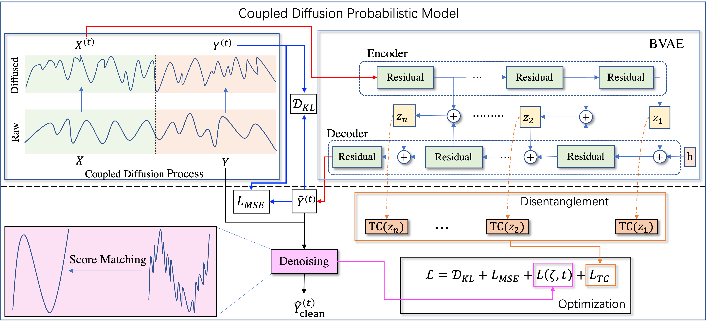
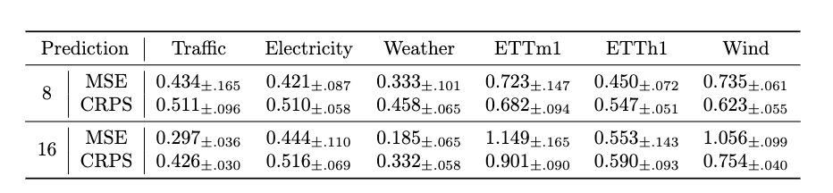

# Generative Time Series Forecasting

We introduce the source code of our paper "Generative Time Series Forecasting with Diffusion, Denoise, and Disentanglement" (NeurIPS 2022).


## TroubleShooting in PSC :

1. Issue with `cudnn`

* Problem: 
```
W0623 12:29:30.035391 62732 dynamic_loader.cc:305] The third-party dynamic library (libcudnn.so) that Paddle depends on is not configured correctly. (error code is /usr/local/cuda/lib64/libcudnn.so: cannot open shared object file: No such file or directory)
```

* Solution:

I installed `cudnn` with version 7.6 and set the env path as it is:
```Bash
(d3vae) [yyin4@v024 d3vae]$ conda install -c conda-forge cudnn=7.6
export LD_LIBRARY_PATH=/ocean/projects/cis230033p/sko1/.conda/envs/d3vae/lib
``` 

## D3VAE with pcap/netflow training

* Configurations 
   * If you want to change the data split portion, you need to change the embeded numbers. (left TODO there)
   * If you want to change the output dir or checkpoint dir, you need to change the embedded path name. 
   * --sequence_length: input length (default is 16)
   * --prediction_length: output length (default is 16)
   * --percentage: the used percentage of the whole dataset (I think for our exp, this should be 1)
   * --skip_testing: whether you will skip testing during the training (You still need to change the embedded numbers of data split)
   * --data_split: train/vali/test

1. PCAP 

```
python main.py      --root_path ../../dataset --data_path ohe-pcap.csv \
                     --input_dim 13 --target_dim 13  --percentage 0.05 --diff_steps 1000 --features='M' \
                     --beta_end 0.1 --inverse True --itr 1 --skip_testing True --data_split '0.7,0.3,0.0'
```

2. Netflow

```
python main.py      --root_path ../../dataset --data_path ohe-netflow.csv \
                     --input_dim 17 --target_dim 17 --percentage 0.05 --diff_steps 1000 --features='M' \
                     --beta_end 0.1 --inverse True --itr 1  --skip_testing True --data_split '0.7,0.3,0.0'
```

## D3VAE with pcap/netflow generation

```
python main.py      --root_path ../../dataset --data_path ohe-pcap.csv     \                
                      --input_dim 13 --percentage 0.05 --diff_steps 1000  --features='M' --target_dim=13  \             
                      --beta_end 0.1 --inverse True --generate True --checkpoints ./checkpoints/ohe-pcap.csv_sl_16_pl16_0_dim-1_scale0.1_diffsteps1000_itr0 --data_split '0.7,0.3,0.0'
```

```
python main.py      --root_path ../../dataset --data_path ohe-netflow.csv     \                
                      --input_dim 17 --percentage 0.05 --diff_steps 1000  --features='M' --target_dim=17  \             
                      --beta_end 0.1 --inverse True --generate True --checkpoints ./checkpoints/ohe-netflow.csv_sl_16_pl16_0_dim-1_scale0.1_diffsteps1000_itr0 --data_split '0.7,0.3,0.0'
```

## D3VAE post-process from root folder with this configuration
```
IS_TARGET_APPENDED = False
```

If you find this code or any of the ideas in this paper useful, please consider citing:
```bibtex
@inproceedings{li2022generative,
title={Generative Time Series Forecasting with Diffusion, Denoise, and Disentanglement},
author={Yan Li and Xinjiang Lu and Yaqing Wang and Dejing Dou},
booktitle={Advances in Neural Information Processing Systems},
editor={Alice H. Oh and Alekh Agarwal and Danielle Belgrave and Kyunghyun Cho},
year={2022}
}
```

We propose a generative time series forecasting method on top of 
VAE equipped with diffusion, denoise, and disentanglement, namely ${D^3}VAE$. 
The framework overview is as follows: 




We implement ${D^3}VAE$ with Python 3.8 and PaddlePaddle 2.3.2 
([paddlepaddle](https://www.paddlepaddle.org.cn/en)). 


## Installation


Run the following command to install the required dependencies.
   
```
pip install -r requirements.txt
```

## Data Preparation

   *Change the **$root_path** and **$data_path** to your own data directory and dataset name, respectively. 
   This code only supports **.csv** file now.*

The public datasets used in the paper are listed as follows.

***Electricity:*** 
https://archive.ics.uci.edu/ml/datasets/ElectricityLoadDiagrams20112014

***Traffic:*** 
http://pems.dot.ca.gov

***Weather:*** 
https://www.bgc-jena.mpg.de/wetter/

***ETTs:*** 
https://github.com/zhouhaoyi/ETDataset

Besides, we adopt a collected WindPower dataset which is available 
[here](https://github.com/PaddlePaddle/PaddleSpatial/tree/main/paddlespatial/datasets/WindPower).


## Reproduce Experimental Results

Run the following commands to reproduce the results in our paper, 
you need to change the **$root_path** and **$data_path** to your own path and data name.
And you need to set the `--sequence_length` and `--prediction_length` to train and forcast time series in different lengths.

<details>
<summary>Traffic</summary>

```
python main.py    --root_path $root_path --data_path $data_path \
                  --input_dim 862 --percentage 0.05 --diff_steps 1000 \
                  --beta_end 0.1
```

</details>

<details>
<summary>Electricity</summary>

```
python main.py       --root_path $root_path --data_path $data_path \
                     --input_dim 321 --percentage 0.03 --diff_steps 1000 \
                     --beta_end 0.1
```

</details>

<details>
<summary>Weather</summary>

```
python main.py       --root_path $root_path --data_path $data_path \
                     --input_dim 21 --percentage 0.02 --diff_steps 1000 \
                     --beta_end 0.1
```

</details>

<details>
<summary>ETTm1</summary>

```
python main.py       --root_path $root_path --data_path $data_path \
                     --input_dim 7 --percentage 0.01 --diff_steps 1000 \
                     --beta_end 0.1
```

</details>

<details>
<summary>ETTh1</summary>

```
python main.py       --root_path $root_path --data_path $data_path \
                     --input_dim 7 --percentage 0.05 --diff_steps 1000 \
                     --beta_end 0.1
```

</details>

<details>
<summary>Wind</summary>

```
python main.py       --root_path $root_path --data_path $data_path \
                     --input_dim 7 --percentage 0.02 --diff_steps 1000 \
                     --beta_end 0.1
```

</details>


### Basic Parameters

| Params                   | Description                                                                                                               |
|:-------------------------|:--------------------------------------------------------------------------------------------------------------------------|
| --sequence_length        | The length of input series.                                                                                               |
| --prediction_length      | The length of output series, which should be exactly the same as the input length.                                        |
| --input_dim              | Number of dimensions of input series.                                                                                     |
| --embedding_dimension    | Number of dimensions of the embedding.                                                                                    |
| --percentage             | Percentage of the original dataset, it should be set between [0, 1] to decide the <br/> percentage of the sliced dataset. |


### Parameters for The Coupled Diffusion Process

| Params          | Description                                                                                |
|:----------------|:-------------------------------------------------------------------------------------------|
| --diff_steps    | The maximum number of the diffusion steps.                                                 |
| --beta_schedule | The type of the diffusion schedule, it could be set to ['quad', 'linear', 'const', 'jsd']. |
| --beta_start    | The start value of the diffusion schedule.                                                 |
| --beta_end      | The end value of the diffusion schedule.                                                   |
| --scale         | The scale parameter of the target diffusion process.                                       |

### Parameters for The BVAE model 

[**NOTE**] 
The implementation of bidirectional vae architecture is built on top of [NVAE](https://github.com/NVlabs/NVAE).

| Params                   | Description                                       |
|:-------------------------|:--------------------------------------------------|
| --num_layers             | \#layers adopted in the RNN model.                |
| --num_channels_enc       | \#channels of the encoder in BVAE.                |
| --num_preprocess_blocks  | \#preprocess blocks.                              |
| --num_preprocess_cells   | \#cells in a preprocess block.                    |
| --groups_per_scale       | \#total groups.                                   |
| --num_postprocess_blocks | \#post-process blocks.                            |
| --num_channels_dec       | \#channels of the decoder in BVAE.                |
| --num_latent_per_group   | \#channels of the latent variables in each group. |


### Results

Some basic results can be seen as follows. 
Note that, to obtain better performance, more dedicated parameter tuning is required. 




